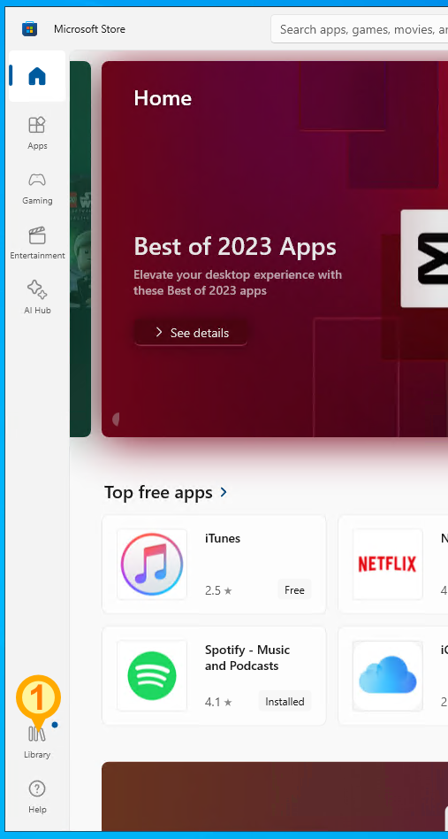

# DSI Course Pre-requisites
This repository contains instructions and scripts to get your computer setup for the Data Science Institute certificate programs.

## Computer requirements
Course-work for the certificate program is not computationally intensive. A desktop or laptop computer running a supported version of Windows, Linux, or macOS will suffice.
  - Windows 10 22H2 or later
  - Windows 11 21H2 or later
  - macOS 12 or later

Please ensure your operating system is up-to-date on maintenance and security updates.

**Note**: This course *cannot* be completed on an iPad or Android tablet.

## Software requirements
For all operating systems, your DSI courses will require the following software:
- Bash
- Git (command-line interface)
- Visual Studio Code
- The Miniconda Python distribution (or the full Anaconda distribution)

Setup instructions for each operating system are below.

## Windows
### Automated installation
This script will check whether course pre-requisites are installed and will install them if not found.

1. Ensure the App Installer is up-to-date in the Microsoft Store (see below)
1. Open Powershell
    - Click the Start Menu, and type "Powershell"
2. Copy the following code, and paste it into Powershell
    - *Note:* The paste function in Powershell is the right-click button on your mouse, or Ctrl+Shift+V in Windows Terminal.
3. Press Enter to run.

```powershell
wget https://raw.githubusercontent.com/dtxe/DSI-Onboarding/windows_onboarding/scripts/windows_autoinstall.ps1 -out windows_autoinstall.ps1
.\windows_autoinstall.ps1

```

### Manual installation
1. [Git](https://git-scm.com/download/win)
    1. *Note:* Git for Windows includes Bash
1. [Visual Studio Code](https://code.visualstudio.com/download)
    1. [Python extension](https://marketplace.visualstudio.com/items?itemName=ms-python.python)
    1. [Jupyter extension](https://marketplace.visualstudio.com/items?itemName=ms-toolsai.jupyter)
1. [The Miniconda Python distribution](https://docs.conda.io/projects/miniconda/en/latest/)
    1. Then, install the required packages by running `pip install numpy pandas matplotlib seaborn scikit-learn jupyter pyyaml` in your Anaconda environment
1. *(Optional, but highly recommended)* [Windows Terminal](https://apps.microsoft.com/detail/9N0DX20HK701?hl=en-US&gl=US)
    1. Add Git Bash to your Windows Terminal profiles by running this [helper script](misc_gitbash_wt.ps1) in Powershell


## Linux or macOS

### Automated installation
Copy and paste the following code into your terminal:
`$ curl https://raw.githubusercontent.com/dtxe/DSI-Onboarding/windows_onboarding/scripts/linux_mac_autoinstall.sh | bash`

### Manual installation
*TODO*


## Updating App Installer on Windows
If you are using an up-to-date and supported version of Windows, but don't have winget, try updating your apps in the Microsoft Store.
- The App Installer component must be updated through the store to use the automatic installation script.


#### On Windows 11


#### On Windows 10


